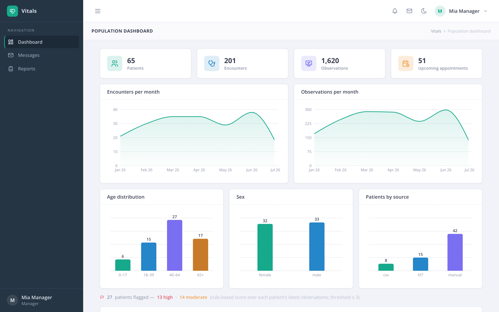
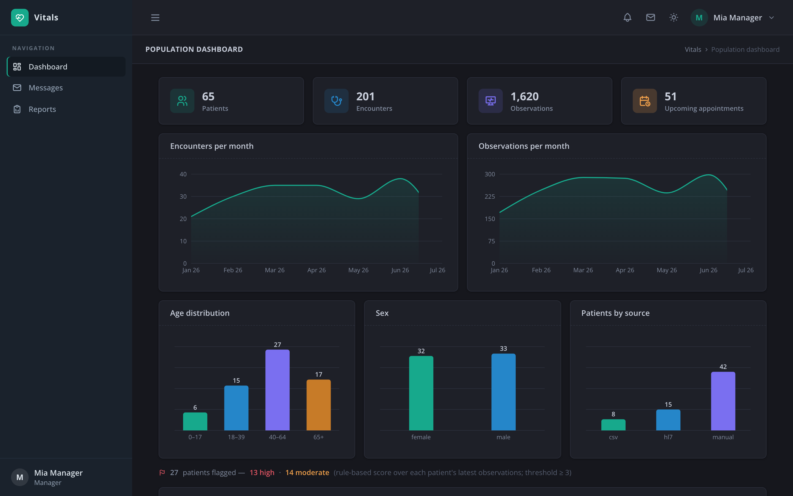
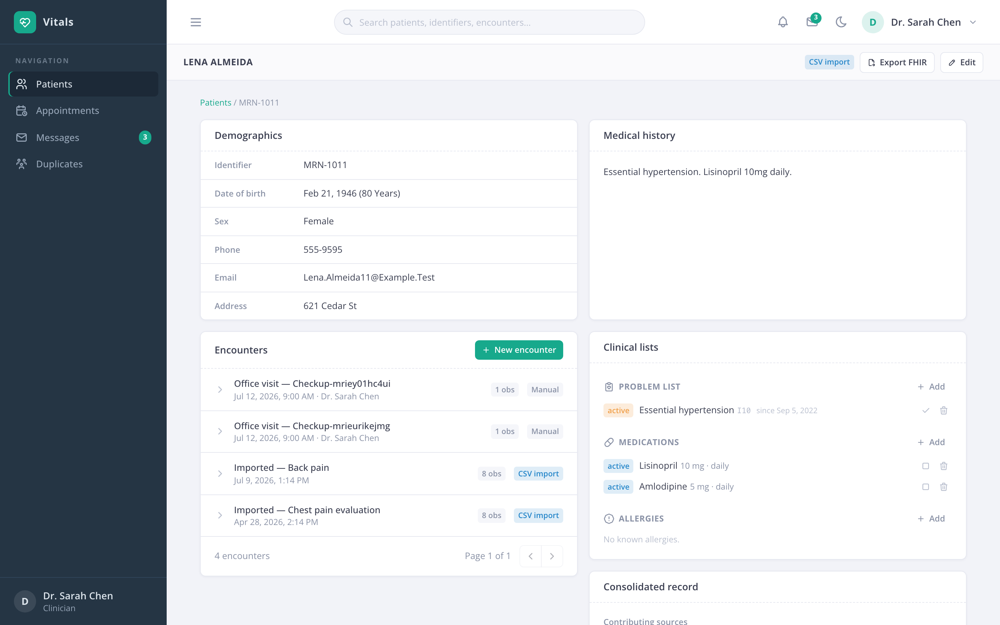
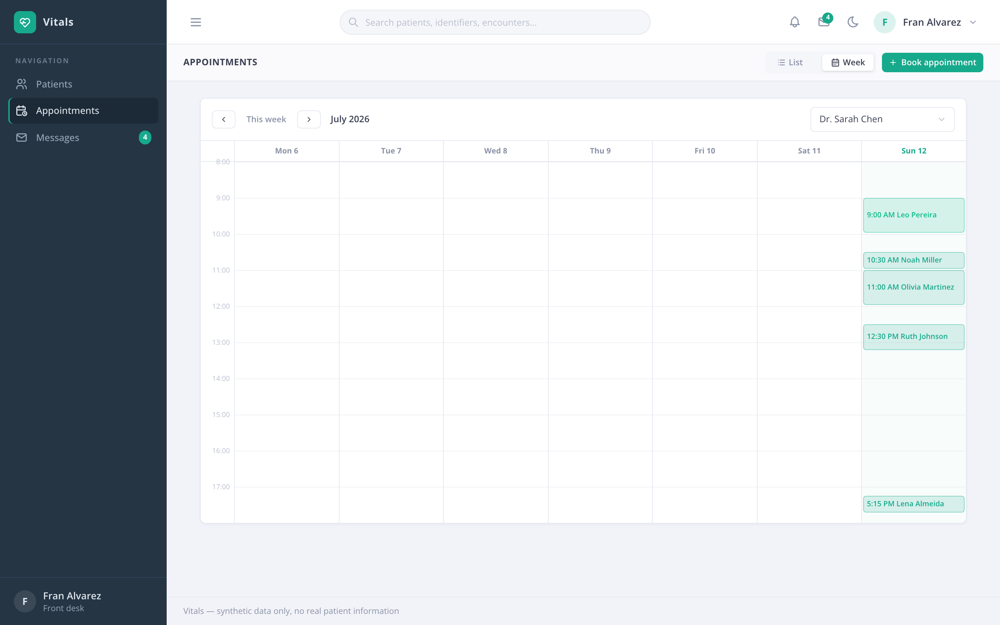

# Vitals

[](https://github.com/pharaujo-git/vitals/actions/workflows/ci.yml)

A health information system with clinical data integration and light analytics:
patient records, appointments and clinical observations, consolidated across
several source formats (CSV, HL7-style messages, FHIR) into one store, with a
population dashboard and explainable risk flags on top.

All sample data is synthetic — no real patient data is used anywhere.



<details>
<summary>More screenshots: dark mode, patient record, week calendar</summary>





</details>

## Stack

- **Backend:** Python, FastAPI, SQLAlchemy 2 + Alembic on PostgreSQL,
  `fhir.resources` for FHIR R4, pandas for analytics, JWT auth
  (python-jose + passlib/bcrypt). Layered: routers → services → repositories.
- **Frontend:** React 19, Redux Toolkit + RTK Query, React Router 7,
  Tailwind CSS 4, Recharts, Vite.

## Features

| Story | Feature |
|---|---|
| US-1 | Patient records: demographics, history, encounters; create/edit/search with pagination |
| US-2 | Appointments: book/move/cancel, overlap validation, daily schedule per clinician |
| US-3 | Clinical observations attached to encounters, validated for type and physiologic range |
| US-4 | Multi-source ingestion: CSV and HL7-style pipe-delimited messages mapped into the common model; mapping errors reported per record, never dropped |
| US-5 | FHIR R4 import and export (Patient + Observation bundles, LOINC-coded) |
| US-6 | Consolidated patient view across sources; duplicate detection with merge/dismiss review |
| US-7 | Population dashboard: counts, trends, demographics, rule-based **explainable** risk flags |
| US-8 | JWT login with roles: administrator, clinician, front desk, manager |
| US-9 | Consent-based access: restricted records with role/user grants; denials are 403 + audited |
| US-10 | Append-only audit log of who viewed/changed what, and when |
| US-11 | Global search across names, MRN identifiers and encounters, scoped to access rights |
| US-12 | Cohort reports with CSV export; identifying fields excluded for non-admin roles |
| US-13 | Internal email-style messaging: threads, multi-recipient, attachments, archive, patient links, live (SSE) unread badges |
| US-14 | Problem list, medications and allergies — feeding risk rules and the FHIR export |
| US-15 | Unified chronological patient timeline across all record types |
| + | Per-patient vitals trend charts (small multiples) |
| + | Imaging & document attachments with inline preview (PNG/JPEG/PDF/DICOM) |
| + | Refresh-token rotation with reuse detection; refresh token in an httpOnly cookie |
| + | Profile page: display name, photo upload, password change |
| + | Admin user management: roles, deactivation, temp-password resets |
| + | Login lockout (5 tries / 15 min) and a forgot-password flow |
| + | Appointment week calendar and a next-free-slot finder |
| + | Live in-app notifications (appointment changes, high-risk alerts) |
| + | Reproducible research evaluation — see [docs/EVALUATION.md](docs/EVALUATION.md) |

A detailed walkthrough of every page — what it shows, who can open it, and the
endpoints behind it — lives in [docs/PAGES.md](docs/PAGES.md); the layering and
entity-relationship diagram in [docs/ARCHITECTURE.md](docs/ARCHITECTURE.md).

## Getting started

**With Docker:** `docker compose up --build`, then seed once with
`docker compose exec backend python seed.py` and open http://localhost:5173.

**Local dev** (Python 3.13+, Node 20+, PostgreSQL running):

```bash
createdb vitals

# Backend
cd backend
python3 -m venv .venv
.venv/bin/pip install -r requirements.txt
cp .env.example .env        # then set a random JWT_SECRET
.venv/bin/alembic upgrade head
.venv/bin/python seed.py    # synthetic demo data (--fresh to wipe first)
.venv/bin/uvicorn app.main:app --port 8000 --reload --timeout-graceful-shutdown 3

# Frontend (second terminal)
cd frontend
npm install
npm run dev                 # http://localhost:5173 (proxies /api to :8000)

# Backend unit tests (needs createdb rights for vitals_test)
cd backend && pip install -r requirements-dev.txt && python -m pytest tests

# End-to-end tests (Playwright; uses the running servers + seeded data)
cd frontend
npx playwright install chromium   # once
npm run e2e

# Research evaluation report → docs/EVALUATION.md
cd backend && python -m evaluation.run
```

CI (GitHub Actions) runs the backend tests, frontend lint/typecheck/build and
the full e2e suite on every push.

### Demo logins (password `password123`)

| Email | Role | Sees |
|---|---|---|
| `admin@vitals.test` | Administrator | everything, imports, audit log, consent rules |
| `chen@vitals.test` | Clinician | patients, encounters, appointments, duplicates |
| `front@vitals.test` | Front desk | patients (no clinical data), appointments |
| `manager@vitals.test` | Manager | population dashboard, cohort reports (de-identified) |

## Layout

```
backend/
  app/
    api/routers/    HTTP controllers (thin: guard → service → audit → map)
    api/schemas.py  Pydantic DTOs (camelCase wire format, Page[T] envelope)
    services/       business logic: ingestion, FHIR, risk rules, consent, ...
    repositories/   all SQLAlchemy queries
    db/models.py    ORM entities
    core/           config, JWT/RBAC security, audit helper
  alembic/          migrations
  seed.py           synthetic data
frontend/
  src/app/          store, router, layout shell
  src/shared/       base API (RTK Query), UI primitives, hooks
  src/features/     one folder per feature: api.ts + types.ts + pages
```

## Research angle

Vitals keeps a focused research surface in clinical data integration and
interoperability: how cleanly heterogeneous sources (CSV extracts, HL7-style
feeds, FHIR bundles) map into one FHIR-compatible model, how mapping errors
are surfaced rather than dropped, and how well name/DOB heuristics resolve
duplicate identities across systems — plus a lightweight, explainable
decision-support layer (transparent rule-based risk scores) as a second angle.

Both angles are backed by reproducible experiments in
[docs/EVALUATION.md](docs/EVALUATION.md): duplicate-detection
precision/recall on synthetically corrupted feeds (with failure modes
quantified by corruption type), and the rule engine benchmarked against a
scikit-learn logistic regression on a cohort with a known generative process.
