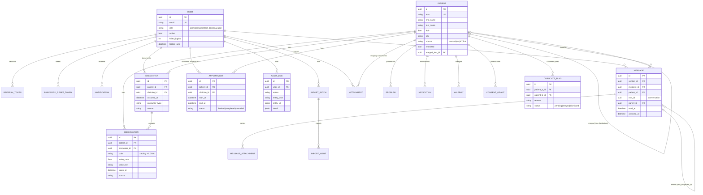

# Vitals — Architecture

## Layers

```
React (features/*)  →  RTK Query (one base API, injected endpoints, SSE signals)
        │ /api (Vite proxy / nginx)
FastAPI routers     →  guard (RBAC + consent) → service → audit → response DTO
Services            →  business logic: ingestion, FHIR, risk rules, matching, …
Repositories        →  every SQLAlchemy query, shared Page/paginate helper
PostgreSQL          →  Alembic migrations (one per feature)
```

Dependency direction is one-way (routers → services → repositories → models);
services never import HTTP schemas, repositories never contain business rules.

## Entity-relationship diagram



## Cross-cutting mechanics

- **Auth** — short-lived JWT access token client-side; refresh token only in
  an httpOnly cookie with server-side rotation state and reuse detection.
- **RBAC** — `require_roles(...)` dependencies per endpoint; admin passes all.
- **Consent** — `ensure_access` gate on every patient-record read/write;
  denials are 403 and audited.
- **Audit** — insert-only trail written from controllers after each sensitive
  view/change.
- **Pagination** — every growable list returns `Page[T]`
  (`items/total/limit/offset`); repositories share one `paginate` helper.
- **Real-time** — SSE channels emit change *signals* from cheap per-user
  fingerprints (messages, notifications); clients refetch through their
  normal queries.
- **Ingestion** — CSV / HL7-style / FHIR all map through the same validation
  (observation catalog, MRN upsert) with per-record error reporting.
- **Duplicate matching** — four explainable tiers (exact, initial,
  edit-distance ≤ 2 blocked by DOB, DOB window ≤ 31 days on exact names),
  measured in [EVALUATION.md](EVALUATION.md).
